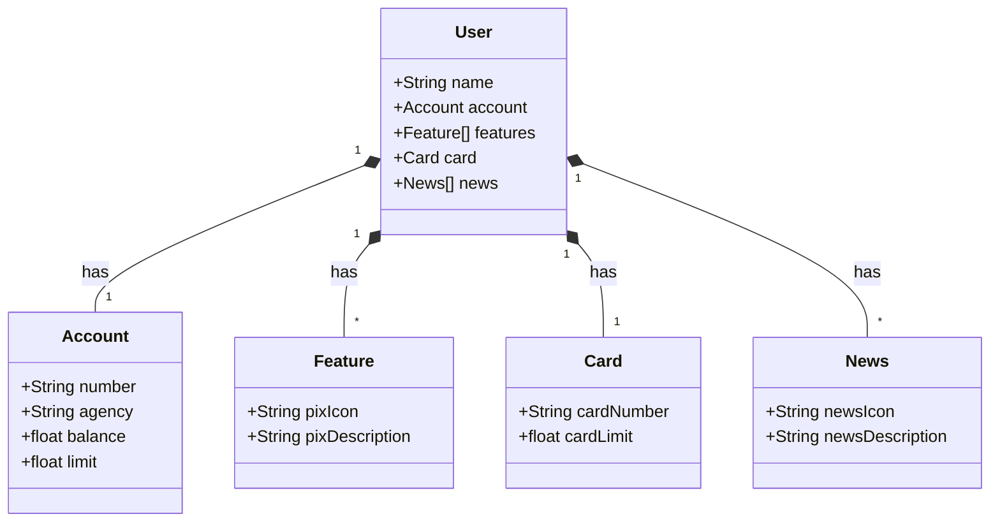

# Avanade 2025  
Java RESTful API criada para o Decola Tech 2025

## Diagrama de classes

```mermaid
classDiagram
    class User {
        +String name
        +Account account
        +Feature[] features
        +Card card
        +News[] news
    }

    class Account {
        +String number
        +String agency
        +float balance
        +float limit
    }

    class Feature {
        +String pixIcon
        +String pixDescription
    }
    

    class Card {
        +String cardNumber
        +float cardLimit
    }

    class News {
        +String newsIcon
        +String newsDescription
    }

    User "1" *-- "1" Account : has
    User "1" *-- "*" Feature : has
    User "1" *-- "1" Card : has
    User "1" *-- "*" News : has
```
